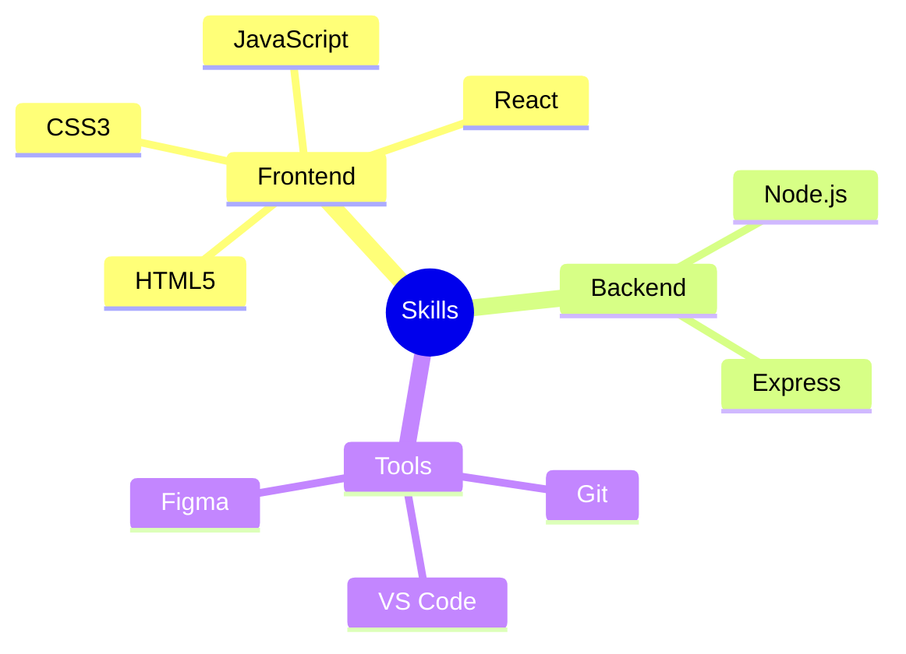

<div align="center">
  <h1>Hello World! I'm Parthiban 🚀</h1>
</div>


### 🧑‍💻 About Me
```javascript
const parthiban = {
    location: "India",
    role: "Web Developer",
    currentFocus: "Building amazing web experiences",
    funFact: "I love turning coffee into code ☕"
};
```

<br/>

### ⚡ Tech Arsenal 
<div align="center">



</div>

### 🌐 Connect with Me
<div align="center">
  <a href="YOUR_LINKEDIN_URL">
    
  </a>
  <a href="YOUR_YOUTUBE_URL">
    
  </a>
  <a href="YOUR_TWITTER_URL">
    
  </a>
</div>

### 📊 GitHub Stats
<div align="center">
  
  <br/>
  
</div>

---

<div align="center">
  <i>⚡ "Code is like humor. When you have to explain it, it's bad." – Cory House</i>
</div>
