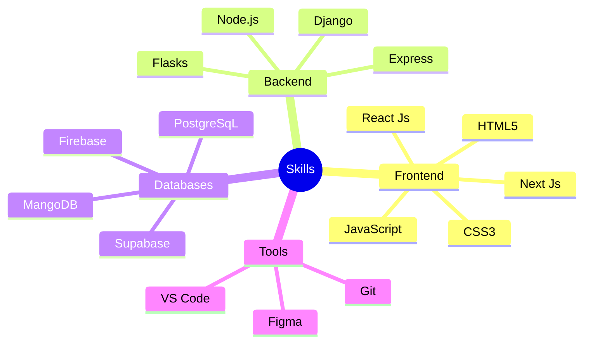

<div align="center">
  <h1 style="font-family: 'Poppins', sans-serif; font-weight: 600;">Hello World! I'm Parthiban 🚀</h1>
  <p align="left">
    
  </p>
</div>

<h3 style="font-family: 'Poppins', sans-serif; font-weight: 500;">🧑‍💻 About Me</h3>

```javascript
const parthiban = {
    location: "India",
    role: "Web Developer",
    currentFocus: "Building amazing web experiences",
    funFact: "I love turning coffee into code ☕"
};
```

<h3 style="font-family: 'Poppins', sans-serif; font-weight: 500;">⚡ Tech Arsenal</h3>

<div align="center">



</div>

<h3 style="font-family: 'Poppins', sans-serif; font-weight: 500;">🌐 Connect with Me</h3>

<div align="center">
  <a href="https://www.linkedin.com/in/parthiban-s-a5b59224b">
    
  </a>
  <a href="https://parthibanportfolio-1.netlify.app/">
    
  </a>
  <a href="https://www.notion.so/A-Passionate-Web-Developer-59c0eb91557a4f24a6ac3272d7c72abc/">
    
  </a>
</div>

<h3 style="font-family: 'Poppins', sans-serif; font-weight: 500;">📊 GitHub Stats</h3>

<div align="center">
  
  <br/>
  
</div>

---

<div align="center">
  <i style="font-family: 'Poppins', sans-serif; font-weight: 300;">⚡ "Code is like humor. When you have to explain it, it's bad." – Cory Hous
